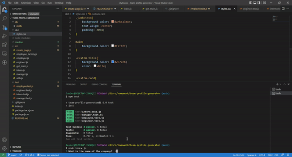
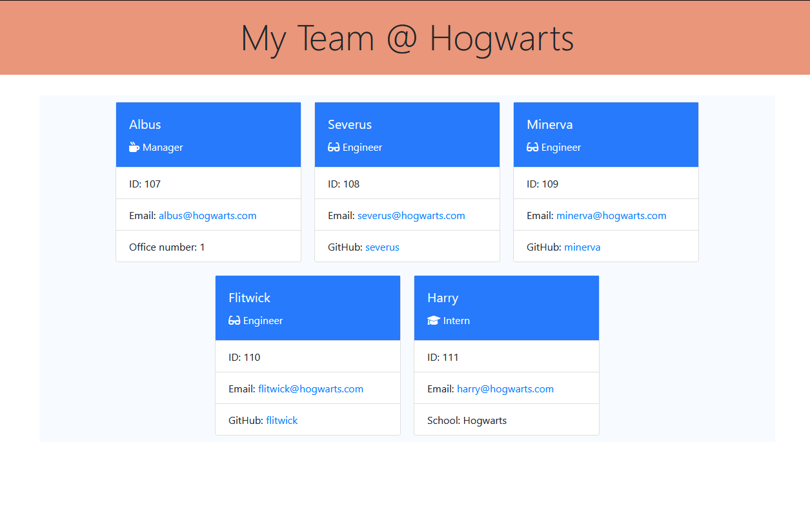

# Team Profile Generator

## Description
Simple [app](./index.js) to generate an [html page](./dist/index.html) for a team profile

## Table of Contents
- [Installation](#installation)
- [Usage](#usage)
- [License](#license)
- [Tests](#tests)
- [Questions](#questions)

## Installation
Navigate to where `package.json` is and type `npm install` to install the dependencies

## Usage
1. `node index.js` to execute the app
1. answer the prompts with the team information.
1. The script will generate the target html in the `dist` directory.

A high quality video of the walkthrough can be found [here](https://youtu.be/7ll4HEqnqSU).

The generated page will look similar to this:

## License

This application is covered under ISC license.

## Tests
Unit tests were written for the four model classes, `Employee`, `Engineer`, `Intern` and `Manager`, to assert their basic functionality. 

## Questions
Contact info

[ lcortes0801](http://github.com/lcortes0801) on Github 

[:email: lcortes0801@gmail.com](mailto:lcortes0801@gmail.com)

  

Made with [Markdown Generator](https://github.com/lcortes0801/mdgen)
